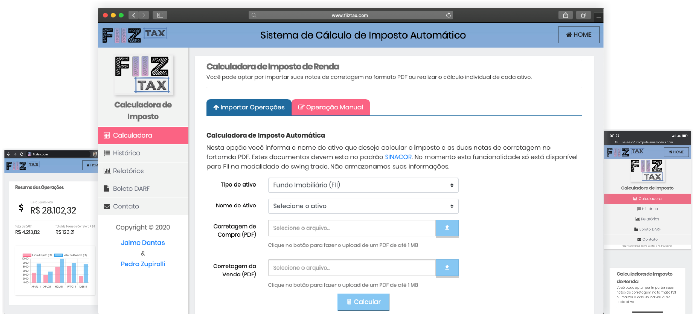

# UI of FIIZ TAZ 

Core system of FIIZ TAX.

## Tecnologies
* Angular 8
* Mobile compatible 

## Run in development mode

Run `npm start` for a front-end dev server. Navigate to `http://localhost:4200/`. The app will automatically reload if you change any of the source files.

## Code scaffolding

Run `ng generate component component-name` to generate a new component. You can also use `ng generate directive|pipe|service|class|module`.

## Build

Run `ng build` to build the project. The build artifacts will be stored in the `dist/` directory. Use the `-prod` flag for a production build.

## Run in production mode

``
ng serve $IP --disable-host-check
``

## License
This project is licensed under the
MIT License - see the [LICENSE](LICENSE) file for details.
